# Manual técnico del Sistema COEPCI

Secretaría de la contraloría del Estado de Quintana Roo

### **Prerequisitos**

- ***Entorno de desarrollo aplicado***
    - Windows 11
    - Laragon, enlace de descarga: <https://laragon.org/>

### **Framework y estándar**

- ***Laravel***
    - Framework 10.48.12

- ***VueJS***
    - Versión 3

- ***PHP***
    - Versión de PHP 8.1

- ***Composer***
    - Versión 2.4.1

- ***Nodejs***
    - Versión 18.8.0

- ***npm***
    - Versión 8.18.0

- ***Base de datos***
    - MariaDB Versión 8.0.30

### **Scripts de instalación**
#### Comandos artisan:
`composer create-project --prefer-dist laravel/laravel^10 coepci` 
`composer require laravel/ui` 
`composer require maatwebsite/excel` 
`composer require rap2hpoutre/laravel-log-viewer` 
`composer require spatie/laravel-permission` 
`composer require spatie/db-dumper` 
`composer require spatie/laravel-backup` 
`composer require spatie/laravel-ignition` 
`composer require laravel/breeze` 
`composer require laravel/sail` 

#### Comandos npm:
`npm install` 
`npm install bootstrap` 
`npm install vue -–save-dev ` 
`npm install @vitejs/plugin-vue` 
`npm install bootstrap-icons` 
`npm install jquery popper.js` 
`npm install sweetalert2` 
`npm install vue-loader` 
`npm install vue-paginate-al vue-pagination-2 vue3-pagination` 
`npm install xlsx` 

### **Diagrama entidad relación**

```mermaid
erDiagram
    bitacora {
        int id PK
        varchar id_user FK
        int id_depen FK
        varchar action
        timestamp created_at
        timestamp updated_at
    }
    concursos {
        int id PK
        varchar descripcion
        date fechaIni1ronda
        date fechaIni2ronda
        date fechaFin
        text comentario
        int id_depen FK
        timestamp created_at
        timestamp updated_at
    }
    configuracion {
        int id PK
        int veda
        timestamp updated_at
    }
    imagenes {
        int id PK
        mediumtext nombre
        mediumtext ruta
        varchar tipo
        int estado
        timestamp created_at
        timestamp updated_at
    }
    faq {
            int id PK
            longtext pregunta
            longtext respuesta
            timestamp created_at
            timestamp updated_at
    }
    dependencias {
        int id PK
        mediumtext descripcion
        timestamp created_at
        timestamp updated_at
    }
    empleados {
        int id PK
        int id_grup FK
        varchar curp
        varchar nombre
        varchar apellido_paterno
        varchar apellido_materno
        varchar cargo
        int id_depen FK
        timestamp created_at
        timestamp updated_at
    }

    ganadores {
        int id PK
        int id_conc FK
        int id_grup FK
        mediumtext id_emp
        timestamp created_at
        timestamp updated_at
    }
    grupos {
        bigint id PK
        varchar grupo
        timestamp created_at
        timestamp updated_at
    }

    historico_votos {
        int id PK
        mediumtext nombre
        int id_grup
        int id_conc
        int ronda
        int novotos
        timestamp created_at
        timestamp updated_at
    }

    manuales {
        int id PK
        varchar nombre
        timestamp created_at
        timestamp updated_at
    }

    registros {
        int id PK
        int id_vot FK
        int id_nom FK
        int id_grup FK
        int id_conc FK
        int ronda
        timestamp created_at
        timestamp updated_at
    }
    respaldo {
        int id PK
        varchar filename
        datetime creation_date
        float size_mb
    }
    users {
        int id PK
        varchar name
        varchar email
        timestamp email_verified_at
        varchar password
        varchar remember_token
        int id_depen FK
        timestamp created_at
        timestamp updated_at
    }

    model_has_permissions {
        int permission_id FK
        varchar model_type
        int model_id FK
    }
    model_has_roles {
        int role_id FK
        varchar model_type
        int model_id FK
    }
    permissions {
        int id PK
        varchar name
        varchar guard_name
        timestamp created_at
        timestamp updated_at
    }
    personal_access_tokens {
        int id PK
        varchar tokenable_type
        int tokenable_id
        varchar name
        varchar token
        text abilities
        timestamp last_used_at
        timestamp expires_at
        timestamp created_at
        timestamp updated_at
    }
    roles {
        int id PK
        varchar name
        varchar guard_name
        timestamp created_at
        timestamp updated_at
    }
    role_has_permissions {
        int permission_id FK
        int role_id FK
    }

    users ||--|{ dependencias : "pertenece a"
    bitacora ||--|{ dependencias : "pertenece a"
    concursos ||--|{ dependencias : "pertenece a"
    empleados ||--|{ dependencias : "pertenece a"
    empleados ||--|{ grupos : "pertenece a"
    ganadores ||--|{ concursos : "pertenece a"
    ganadores ||--|{ grupos : "pertenece a"
    registros ||--|{ concursos : "pertenece a"
    registros ||--|{ grupos : "pertenece a"
    registros ||--|{ empleados : "pertenece a"
    model_has_permissions ||--|{ permissions : "pertenece a"
    model_has_roles ||--|{ roles : "pertenece a"
    role_has_permissions ||--|{ permissions : "pertenece a"
    role_has_permissions ||--|{ roles : "pertenece a"

```

